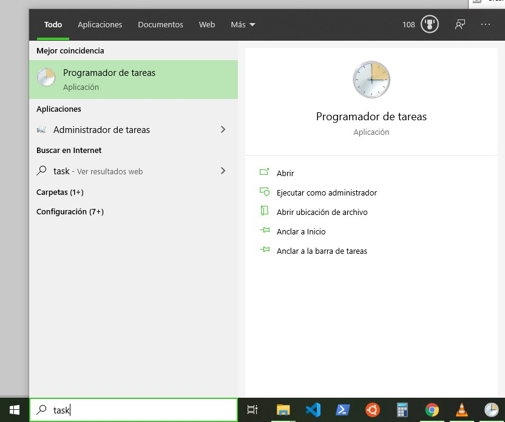
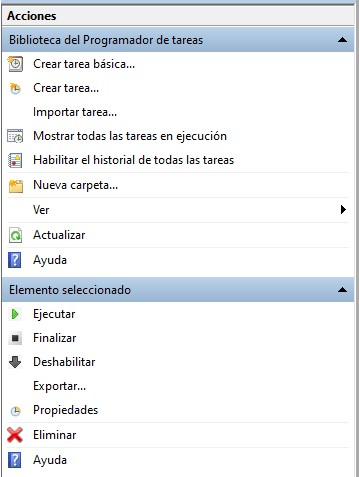
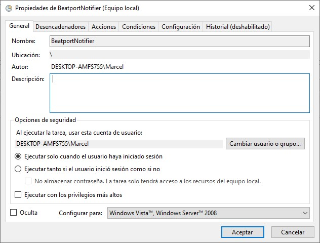
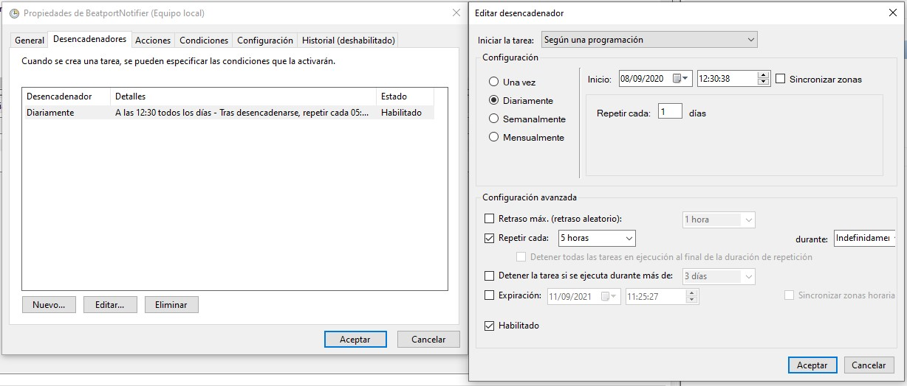
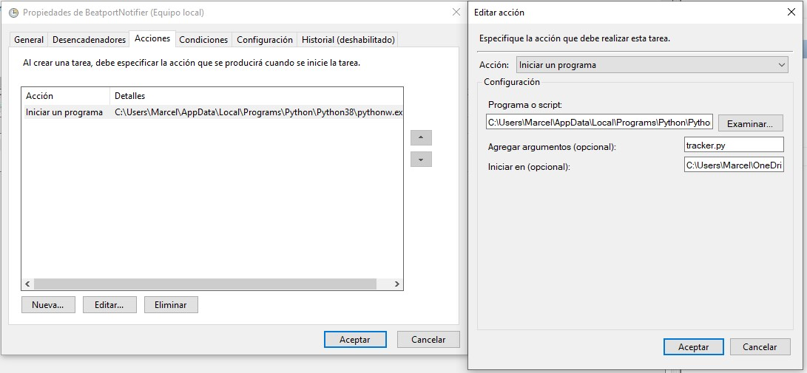

# Beatport Notifier
## Get an email notification when a selected album is uploaded to Beatport

It gives you an email when a new album is uploaded from selected labels in the config file. If it finds something it gives you an email and the program closes, and if you put it in the task scheduler the next day will be up again, if it finds nothing the program will sleep for 5h until a new check. 

Just modify the config file and the startBatch with your own configuration and add run.vbs to Windows task scheduler to run the script at startup.

# Steps to schedule a python script task 

## Step 1:
### Search for task scheduler

## Step 2:
### Click on create task

## Step 3:
### General tab looks like this

## Step 4:
### I made that trigger which is set to run everyday each 5h from 12 o'clock

## Step 5:
### Here you need to select as the action "Run a program", then, in "Program or script" you need to put your python path executable, and if you want the script to run in the background without a wierd pop-up terminal appearing each time, you need to pass "pythonw.exe" instead of "python.exe", so my path looks like this "C:\Users\Marcel\AppData\Local\Programs\Python\Python38\pythonw.exe" (Without quotes).
### Then in "Add arguments" you need to put the script name, in this case "tracker.py" and in "Run in" you need to put the location of the script, in my case "C:\Users\Marcel\OneDrive - UNIVERSIDAD DE SEVILLA\GitHub\beatport-notifier" (No need of quotes if the path has spaces)

